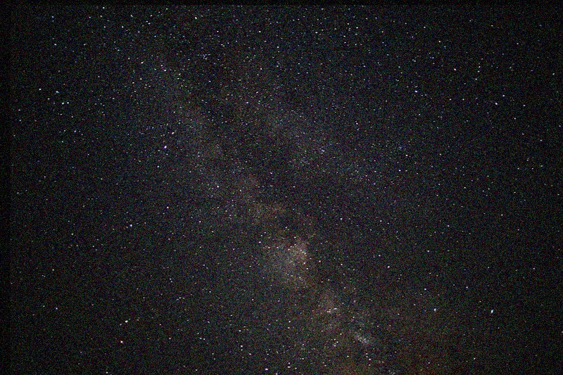
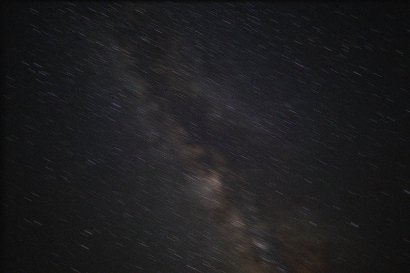
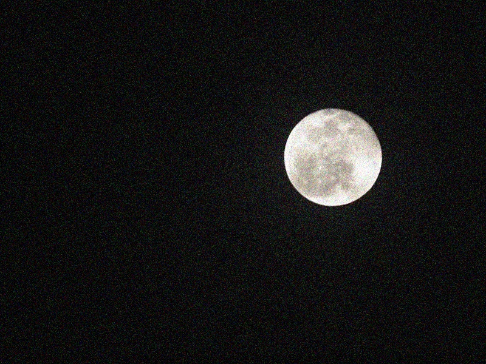
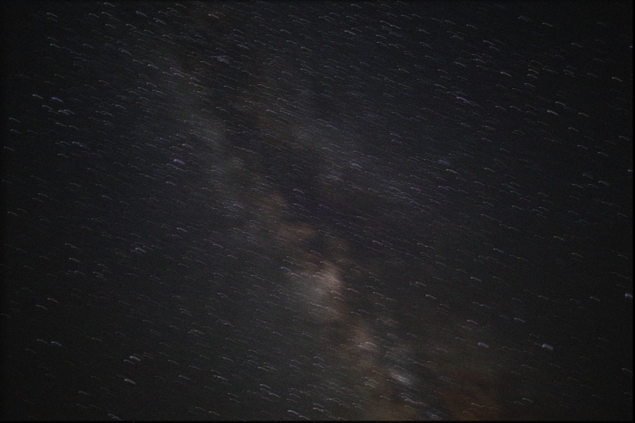
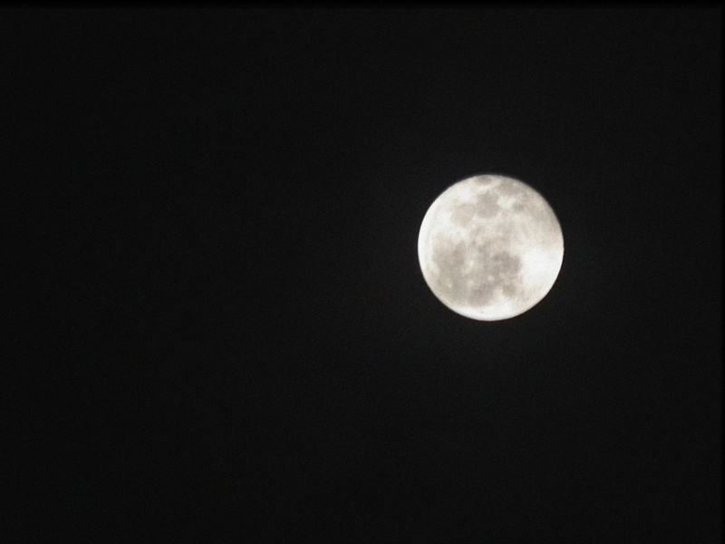

# Denoising for Astrophotography

* [1. Description](#1-description)
* [2. Experiment](#2-experiment)
   * [a) Running average of the frames without frame alignment](#a-running-average-of-the-frames-without-frame-alignment)
      * [Overall Thought of the Algorithm](#overall-thought-of-the-algorithm)
      * [Matlab Code](#matlab-code)
      * [Experimental Result](#experimental-result)
      * [Experimental Effect](#experimental-effect)
   * [b) Running average of the frames with frame alignment](#b-running-average-of-the-frames-with-frame-alignment)
      * [Overall Thought of the Algorithm](#overall-thought-of-the-algorithm-1)
      * [Matlab Code](#matlab-code-1)
      * [Experimental Result](#experimental-result-1)
      * [Experimental Effect](#experimental-effect-1)

------

## 1. Description

Amateur astrophotographers often set up static cameras pointed toward particular regions of the night sky and record for an extended period of time. Among the handouts, you can find two videos hw1 sky 1.avi and hw1 sky 2.avi, which contain two recordings of the night sky each lasting a few minutes. **Low light levels cause the video frames to be noticeably noisy.** 

------

## 2. Experiment

### a) Running average of the frames without frame alignment

#### Overall Thought of the Algorithm

According to the rules
$$
\begin{array}{l}{f_{\text {average}}^{1}=f^{1}} \\ {f_{\text {average}}^{t}=\frac{t-1}{t} f_{\text {average}}^{t-1}+\frac{1}{t} f^{t}, t=2,3, \ldots}\end{array}
$$
I found that  $f_{average}^{30}$ is based on $f_{average}^{t}$ and $f^{t}$

- $f^{t}$: the `t` frame of the video
- $f_{average}^{t}$: running average of the frames $f^{t}$ in the video without frame alignment, and it is given by a <u>recursive formula</u>
  - **Recursive termination condition:** the running average of the first frame is the first frame itself(because it haven't running, so we cannot calculate the average yet)
  - **Recursive expression:** $f_{average}^{t}$ is calcluate by weighted summation of $f_{average}^{t-1}$ and $f^{t}$, the weights is $\frac{t-1}{t}$ and $\frac{1}{t}$

#### Matlab Code

- **Loop version**

  ```matlab
  vidobj = VideoReader([video_path,video_name]); 
  frame_average_last = im2double(read(vidobj, 1));    % first frame of the video
  for t=2:30
      frame_now = im2double(read(vidobj, t));
      frame_average = (t-1)/t * frame_average_last + 1/t * frame_now;     % weighted summation
      frame_average_last = frame_average;     % update the fresh frame
  end
  ```

- **Recursive version**

  ```matlab
  vidobj = VideoReader([video_path,video_name]); 
  
  result = f_a(30, vidobj);
  imshow(result);
  
  function frame = f(t, vidobj)
  % return the "t"th frame of the video input
  
  frame = im2double(read(vidobj, t));
  
  end
  
  function frame = f_a(t, vidobj)
  % return the "t"th running average of the frames f_t 
  % without frame alignment
  
  if t==1
      frame = f(1, vidobj);
  else
      frame = (t-1)/t * f_a(t-1, vidobj) + 1/t * f(t, vidobj);
  end
  
  end
  ```

#### Experimental Result

sky1 original



sky1 average



sky2 original



sky2 average


#### Experimental Effect

From the images above we can see clearly that there are many noise in the origin images, but after averaging of each images without frame alignment, there are few noise.

But, on the other hand, the sharp features are also blurred by the averaging operation. Stars become light tracks and the sharp detail of the moon has been blurry. The modified imagines don't look clear as before visually.

------

### b) Running average of the frames with frame alignment

#### Overall Thought of the Algorithm

According to the rules
$$
\begin{array}{l}{f_{\text {average}}^{1}=f^{1}} \\ {f_{\text {average}}^{t}=\frac{t-1}{t} f_{\text {average}}^{t-1}+\frac{1}{t} Align(f^{t}, f_{average}^{t-1}), t=2,3, \ldots}\end{array}
$$

- **Align(f,g):** aligns frames f and g by minimizing the mean squared difference over a set of horizontal and vertical shifts. 

The algorithm calculates the mean squared differences over a set of horizontal and vertical shifts between the averaged frame and the shifted frame, then the frame which has the smallest mean squared differences among the averaged frame will be chosen.

#### Matlab Code

- shift the image

  ```matlab
  function frameTform = imshift(frame, dx, dy)
  % shift the img where
  % move right dx
  % move up dy
  
  A = [1 0 0; 0 1 0; dx dy 1];
  tform = maketform('affine', A);
  [height, width, channels] = size(frame);
  frameTform = imtransform(frame, tform, 'bilinear', ...
                              'XData', [1 width], ...
                              'YData', [1 height], ...
                              'FillValues', zeros(channels, 1));
  ```

- calculate Align(f, g)

  ```matlab
  function min_msd_frame = Align(f, g)
  % aligns frames f and g by minimizing the mean squared difference 
  % over a set of horizontal and vertical shifts. 
  
  [M,N,type] = size(f);
  
  % initialize min_msd_frame with the origin frame
  diff = f - g;
  min_msd = sum(sum(diff .^ 2)) / (M * N);
  min_msd_frame = f;
  min_index = [0, 0];
  
  n = 10;     % user-defined
  
  % loop the shift choices
  % choose the smallest mean squared differences among the averaged frame
  for dx=-n:n
      for dy=-n:n
          
          shifted_f = imshift(f, dx, dy);
          [M,N,type] = size(shifted_f);
          
          % crop the shifted frame
          rowl = 1; rowr = M + dy;
          colt = dx + 1; colb = N;
          if rowr > M, rowr = M; end
          if colt < 1, colt = 1; end
          
          sub_f = shifted_f(rowl:rowr, colt:colb, type);
          sub_g = g(rowl:rowr, colt:colb, type);
          
          % calculate the mean square difference
          diff = sub_f - sub_g;
          [M,N,type] = size(sub_f);
          msd = sum(sum(diff .^ 2)) / (M * N);
          
          % update to the smallest one
          if msd < min_msd
              min_msd = msd;
              min_msd_frame = shifted_f;
              min_index = [dx, dy];
          end
          
      end
  end
  
  end
  ```

- calculate running average of the frames without frame alignment

  ```matlab
  vidobj = VideoReader([video_path,video_name]); 
  
  frame_average_last = im2double(read(vidobj, 1));
  for t=2:30
      t
      frame_now = im2double(read(vidobj, t));
      frame_average = (t-1)/t * frame_average_last + 1/t * Align(frame_now, frame_average_last);
      frame_average_last = frame_average;
  end
  ```

#### Experimental Result

sky1 without shifting


sky1 shift with n=3



sky1 shift with n=10


sky2 without shifting


sky2 shift with n=3


sky2 shift with n=10



#### Experimental Effect

From the images above we can see clearly that this algorithm can not only denoising, but can also reserve the sharp detail of origin image.

The algorithm use the shifting frames in which the features are very close to the last modified frame to average the noise.

But during my experiment, I still have to question. Here, I want to state my own viewpoint:

- Firstly, the algorithm is inefficient, because it should calculate all the shifted frame to get the smallest mean squared difference, hence, it hold high time complexity. But during my experiment, I console all the "best choice" which mean the frame get the smallest Align(). They are listed here:

  | t    | dx   | dy   |
  | ---- | ---- | ---- |
  | 2    | 0    | 0    |
  | 3    | 0    | 1    |
  | 4    | 0    | 1    |
  | 5    | -1   | 2    |
  | 6    | -1   | 2    |
  | 7    | -1   | 3    |
  | 8    | -1   | 3    |
  | 9    | -2   | 4    |
  | 10   | -2   | 4    |
  | 11   | -2   | 5    |
  | 12   | -2   | 5    |
  | 13   | -3   | 6    |
  | 14   | -3   | 6    |
  | 15   | -3   | 7    |
  | 16   | -3   | 7    |
  | 17   | -4   | 8    |
  | 18   | -4   | 8    |
  | 19   | -4   | 9    |
  | 20   | -4   | 9    |
  | 21   | -5   | 10   |
  | 22   | -5   | 10   |
  | 23   | -5   | 10   |
  | 24   | -5   | 10   |
  | 25   | -5   | 10   |
  | 26   | -6   | 10   |
  | 27   | -6   | 10   |
  | 28   | -6   | 10   |
  | 29   | -6   | 10   |
  | 30   | -6   | 10   |

  - `t`: current frame
  - `dx`: x offset of the shifted frame which hold the smallest mean squared differences
  - `dy`: y offset of the shifted frame which hold the smallest mean squared differences
  - We can find that dx is gradually decrease, and dy increase. Hence, I consider that the best choice of next frame hold the smaller ds and larger dy of the sky2, we can store last offset of x and y, and loop before the storage value. It will reduce a lot of calculations.

- Secondly, the result images still hold some details blurred. In my own viewpoint, I guess it may because this algorithm is actually still an operation to reduce the moised by averaging the frames. On the condition that we use averaging operation to reduce noises, it will make the frames blurred.
