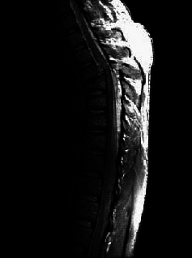

# Gamma变换项目文档

[TOC]

------

## Gamma变换基础知识

### 定义

Gamma变换又称**Power-Law变换**

是对输入图像灰度值进行的**非线性**操作，使输出图像灰度值与输入图像灰度值呈**指数关系**：
$$
J = c * I^{\gamma}
$$

- $I$: 是输入图像

- $J$: 变换后的图像

- $\gamma$: gamma变换参数（正数）

- $c$: 常数（正数）

  > **到底c应该取什么值？是一个固定的常数还是与gamma有关？**
  >
  > 我们可以看到，如果我们只对图像做$J = I^{\gamma}$变换，由于图像的像素介于0～255，每一个像素值的gamma次放可能超出255的范围，这不是我们想要的
  >
  > 因此我们通过c将变换后的图像像素再次变换到0～255范围内
  >
  > 我们可以很容易的得到
  > $$
  > c = \frac{255}{255^{\gamma}}
  > $$
  > 🔎**想想为什么？**

### 作用


- `当$\gamma<1$时` ，从图中我们可以看到，将x轴0附近很小的一个范围转化到y轴很大的一个区域，将x轴L-1附近很大的范围转化到y轴很小的一个区域 => **将黑色像素进行扩展，白色像素进行压缩**

  **经过此gamma变换，我们可以观察到原图中隐藏在黑色区域中的信息**

- `当$\gamma>1$时` ，相反的，将x轴很大的一个范围转换到y轴接近0的一个很小的区域，将x轴L-1附近很小的范围转换到y轴很大的一个区域 =>  **将白色像素进行扩展，黑色像素进行压缩**

  **经过此gamma变换，我们可以观察到原图中隐藏在白色区域中的信息**

- **巧妙记忆：**gamma大于1，白色变多；gamma小于1，黑色变多

------

## Gamma变换代码实现

### 准备工作

#### 读取图像

```python
import matplotlib.image as mpimg        # mpimg 用于读取图片

I = mpimg.imread(filename)			# filename 图片的名字
```

#### 显示图像

```python
import matplotlib.image as mpimg        # mpimg 用于读取图片

plt.figure()										# 新建一个图片
plt.imshow(J, cmap='Greys_r')		# 由于这是灰度图，所以通过第二个参数显示灰度图（默认显示的是热量图）

plt.axis('off') 								# 不显示坐标轴
plt.show()											# 显示图片
```

### 基础版

一个很正常的思维是一个一个遍历原图的像素，将每个像素进行gamma变换，再放到原位置

遍历整张的图片的所有像素之后就可以得到变换后的图像了

```python
def GammaTransform_each_pixel(I, gamma):
    '''
    @description: 逐像素的进行Gamma变换

    @params I: 原图
    @params gamma: Gamma变换参数

    @return : Gamma变换后的图像
    '''
    M, N = I.shape[0], I.shape[1]       # 获取原始图像的尺寸
    J = np.zeros((M, N))                 # 新建与原图同尺寸的空白图片
    
    c = 255 / (255 ** gamma)

    '''逐像素的进行Gamma变换'''
    for i in range(M):
        for j in range(N):
            J[i][j] = c * I[i][j]**gamma

    return J
```

### 高级版

**numpy**科学计算包已经为我们预定义好了很多常用的方法，其中一个我们很常用的手段是把整个向量（这里是一张图片 -> 二维矩阵）当成一个整体进行处理

> 例如. 
>
> ```python
> b = 5
> c = 4
> a = b + c
> ```
>
> 我们可以很清楚的想明白我们做的是把整数b加上整数c，赋值给a
>
> ```python
> A = B + C
> ```
>
> 如果B和C都是一张图片，也可以直接使用加法符号将其的和赋值给A，计算的方法是将B和C的对应位置相加，因此上面的代码等价于
>
> ```python
> M, N = A.shape[0], A.shape[1]
> for i in range(M):
>   for j in range(N):
>     A[i][j] = B[i][j] + C[i][j]
> ```
>
> 我们可以看到numpy的引入，使我们的代码变的更加整洁也更加优美，同时，numpy保证了高效率
>
> > 问题. 如果B和C的shape不一致还可以直接进行相加么？

```python
def GammaTransform(I, gamma):
    '''
    @description: 使用numpy直接对图片进行Gamma变换
    
    @params I: 原图
    @params gamma: Gamma变换参数
    
    @return : Gamma变换后的图像
    '''
    c = 255 / (255**gamma)
    J = c * I**gamma
    return J
```

------

## Gamma变换实战

### 灰度图

#### 图片过暗 | 信息隐藏在黑色中

**原图如下所示**



从图片中我们可以看到，图片整体效果很黑，轮胎的细节信息都隐藏在黑色的像素中，因此我们可以利用gamma变换（gamma<1）

**代码如下**

```python
def process_dark_image(filename):
  I = mpimg.imread(filename)

  gamma = 1
  while gamma > 0.4:
    J = GammaTransform(I, gamma)
    plt.figure()
    plt.imshow(J, cmap='Greys_r')
    gamma -= 0.1

    plt.axis('off')
    plt.show()
```

**gamma变换后的图像如下**


随着gamma的减小，我们可以很明显的看到gamma变化的作用，轮胎的细节可以看的更加清楚，这就是gamma变换的“魔力”

#### 图片过亮 | 信息隐藏在白色中

**原图如下所示**


从图片中我们可以看到，图片整体效果很白，有一种雾蒙蒙的感觉，俯瞰的城市细节信息都隐藏在白色的像素中，因此我们可以利用gamma变换（gamma>1）

**代码如下**

```python
def process_bright_image(filename):
  I = mpimg.imread(filename)

  for gamma in range(1, 6):
    J = GammaTransform(I, gamma)
    plt.figure()
    plt.imshow(J, cmap='Greys_r')

    plt.axis('off')
    plt.show()
```

**gamma变换后的图像如下**


随着gamma的增大，我们可以很明显的看到gamma变化的作用，俯瞰的城市更加清楚，不再有雾蒙蒙的视觉感，湖泊、田地、楼房都看的非常清楚，这就是gamma变换的“魔力”

------

### RGB图片

对于rgb图形我们知道存在三通道，即0通道(r通道)，1通道(g通道)，2通道(b通道)，三个通道分别存储不同色阶的图像信息

可以通过简单的python代码提取三通道的像素值信息

```python
# 提取三通道像素信息
rI, gI, bI = I[:, :, 0], I[:, :, 1], I[:, :, 2]
```

我们可以对rgb图片的不同通道分别进行相应的gamma变换，以达到我们满意的视觉效果

#### 例一

**原图如下**


图像的主要信息是**花朵和叶子**，但是原图给我们的视觉感受是：<u>花朵的红色不够鲜艳，叶子的绿色不够饱满</u>，因此我们很自然的想到应该调整图像的r通道和g通道

**以r通道为例**

只对r通道进行`gamma=0.9`的变换，其他通道保持不变


只对r通道进行`gamma=1.1`的变换，其他通道保持不变


从结果图像中我们可以看到

- 当$\gamma<1$时，图像的红色信息更加凸显，整体图像的红色变得更饱满
- 当$\gamma>1$时，图像的红色信息被压缩

我们调整gamma的三个分量值，以达到我们满意的效果（每个人有自己的审美观，不一定按照老师的参数来）

**老师的示例参数结果**

`gamma_r = 0.9  gamma_g = 0.8`


`gamma_r = 0.9  gamma_g = 0.8  gamma_b = 0.9`


我们可以看到第二张图更加自然，这是因为添加了b通道的gamma变换，这告诉我们当我们要调整某一通道时，其他通道很可能也要进行相应的变换

> 同学们可以自己反复实验不同参数，得到满意的变换效果
>
> 也可以使用python的其他库（比如PyQT）进行一些简单界面的设计，使得可以动态的调整gamma的三个分量的值

------

#### 例二

**原图如下**


从原图中我们可以看到，窗子里面的室内较暗，室内大体是墙和池水，因此我们的gamma大体上应该小于1，以图像黑色信息

**Gamma变换结果**


从变换结果中可以看到室内的墙壁可以看的更清楚，池水的蓝色也更加凸显，达到了增强的效果