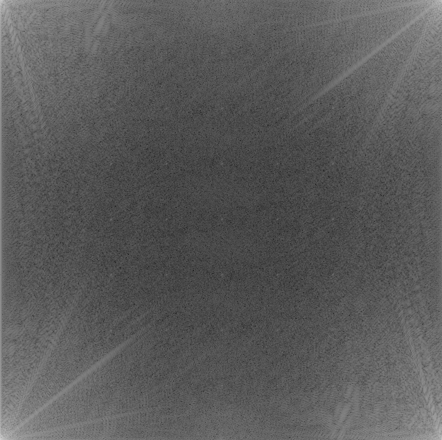
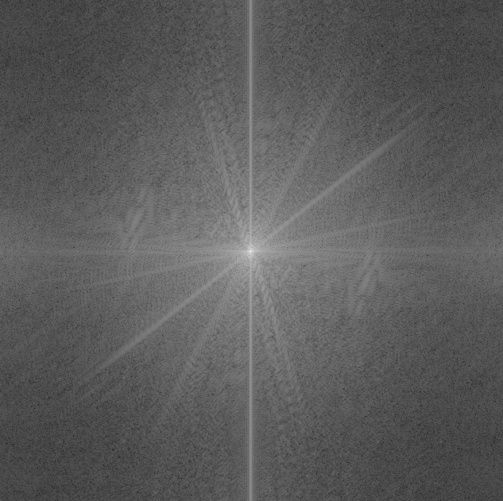

# Fourier变换

* [显示Fourier图像](#显示fourier图像)
* [频域图像处理（还没具体实现）](#频域图像处理还没具体实现)
* [低通滤波器 | 平滑](#低通滤波器--平滑)
* [高通滤波器 | 锐化](#高通滤波器--锐化)

------

## 显示Fourier图像

- `imfft = abs(fft2(img))`: 进行快速傅立叶变换，处理复数幅值

- `imfftlog = log10(1 + imfft)`: 压缩最大和最小像素之间的差距

- `imfftshifted = fftshift(imfftlog)`: 将低频信号在中心点对齐

  

------

## 频域图像处理（还没具体实现）

1. 原图$f$增加padding
2. 滤波器$h$加padding
3. 计算$f_p$和$h_p$的傅立叶变换$F$和$H$
4. 计算F和H在频域的乘积$G=F*H$
5. IDFT得到$g_p$
6. 去除padding得到处理后的图像$g$

------

## 低通滤波器 | 平滑

------

## 高通滤波器 | 锐化