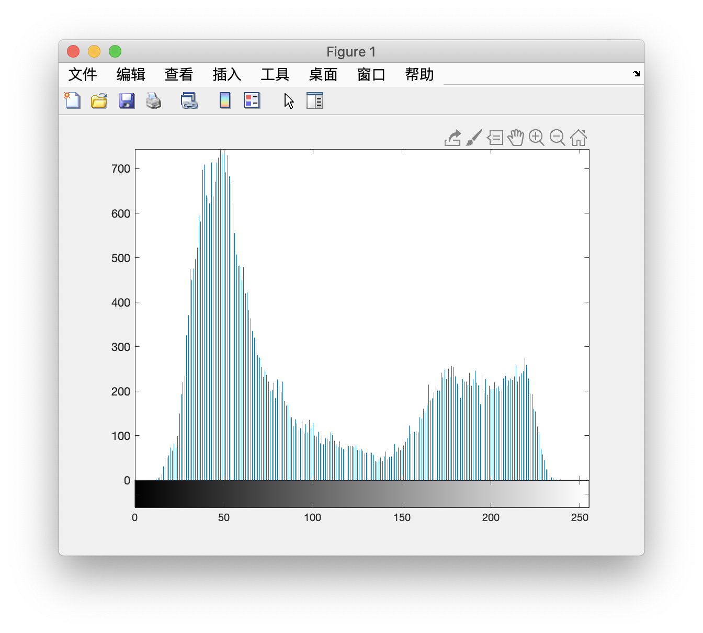
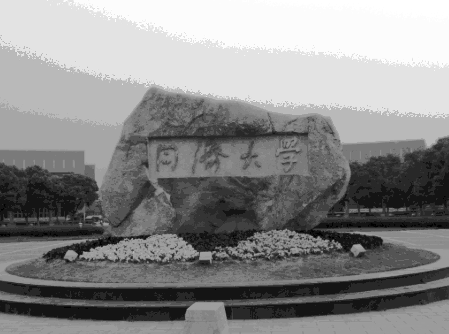
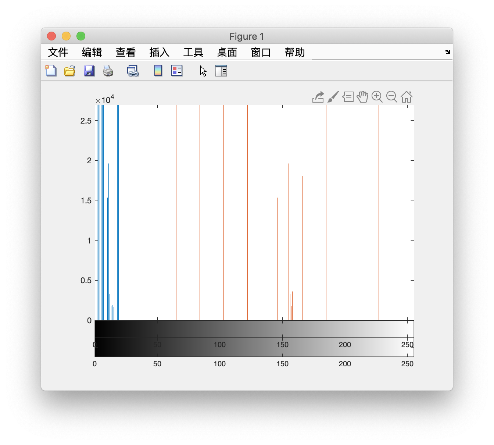
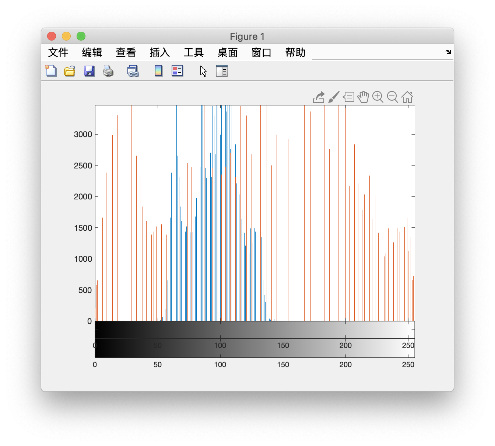

# 直方图 | Histogram

[TOC]

------

## 直方图计算 | Histogram Computation

- **公式：**

$$
h(r_k) = n_k, \ \ r_k：第k个灰度级 \  n_k：灰度级位rk的像素数
$$

- **库函数：**

  ```matlab
  imhist(I);
  ```

  

------

## 直方图均衡化 | Histogram Equalization

- **公式：**
  $$
  s = (L - 1)\sum_{j=0}^{k}\frac{n_j}{M*N} \\ \\ L为总灰度级 \\ M*N为图像尺寸 \\ n_j为直方图中第j项的值
  $$
  再将原图中的灰度转换为新图像中的灰度级

**原图**


**直方图均衡化**



**前后直方图对比**



**原图**


**直方图均衡化**


**前后直方图对比**

