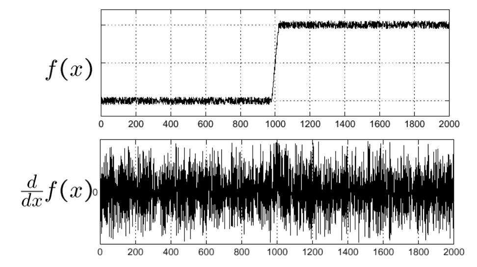
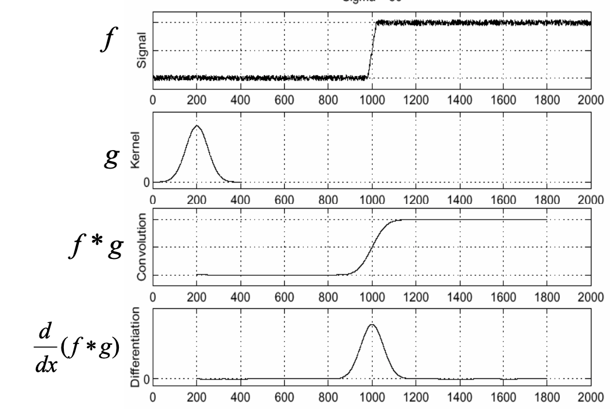
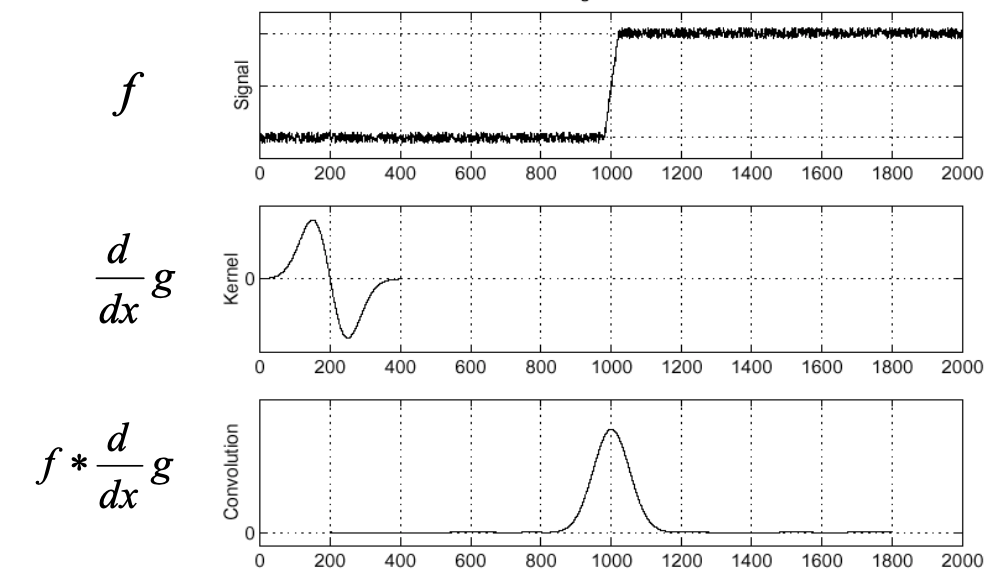

# 图像检测

[TOC]

------

- 一阶导：较粗的边缘
- 二阶导：精细细节（细线，孤立点，噪声）
  - 二阶导会产生双边缘效应
  - 二阶导的符号：边缘的过渡是从亮到暗还是从暗到亮

------

## 孤立点检测

**Laplacian operator**
$$
\nabla^{2} f=\frac{\partial^{2} f}{\partial x^{2}}+\frac{\partial^{2} f}{\partial y^{2}}
$$

$$
g(x, y)=\left\{\begin{array}{l}{1, \text { if }|R(x, y)| \geq T} \\ {0, \text { otherwise }}\end{array}\right.
$$

- T是threshold

  > 影响threshold的因素
  >
  > - noise 噪声
  > - illumination 光照
  > - reflectance 反射

------

## 边缘检测

### 基本边缘检测

**梯度gradient**
$$
\nabla f = (\frac{\partial f}{\partial x}, \frac{\partial f}{\partial y}) \\
\|\nabla f\|=\sqrt{\left(\frac{\partial f}{\partial x}\right)^{2}+\left(\frac{\partial f}{\partial y}\right)^{2}} \\
\theta = arctan2(\frac{\partial f}{\partial x}, \frac{\partial f}{\partial y})
$$

- 近似：用绝对值求和代替平方求和开根（节省计算量）
- $\theta$方向与边缘方向垂直

#### Gradient operators

- Soble operator
  $$
  h_{1}=\left[\begin{array}{ccc}{1} & {2} & {1} \\ {0} & {0} & {0} \\ {-1} & {-2} & {-1}\end{array}\right], h_{2}=\left[\begin{array}{ccc}{-1} & {0} & {1} \\ {-2} & {0} & {2} \\ {-1} & {0} & {1}\end{array}\right]
  $$
  
  > 2起到平滑噪声的功能
  
  
  
- Prewitt operator
  $$
  h_{1}=\left[\begin{array}{ccc}{1} & {1} & {1} \\ {0} & {0} & {0} \\ {-1} & {-1} & {-1}\end{array}\right], h_{2}=\left[\begin{array}{ccc}{-1} & {0} & {1} \\ {-1} & {0} & {1} \\ {-1} & {0} & {1}\end{array}\right]
  $$

#### Derivate with smoothing

由于噪声的存在，每个像素跟它的邻居差异都很大，从一阶导里根本看不出边缘



采用低通滤波器进行平滑处理



改进
$$
\frac{d}{d x}(f * g)=f * \frac{d}{d x} g
$$


- 图片可能变化，事先吧模板的导$\frac{dg}{dx}$算好，提高效率

------

### Marr-Hildreth边缘检测器

#### LoG(Laplacian of Gaussian) operator

$$
\nabla^{2} G_{\sigma}(x, y)=\left(\frac{x^{2}+y^{2}-2 \sigma^{2}}{\sigma^{4}}\right) \exp \left(-\frac{x^{2}+y^{2}}{2 \sigma^{2}}\right)
$$

- 图像的边缘是一阶导的极值，二阶导左右变号

- 先用Gaussian平滑，再对平滑后的图像求二阶导

  ```matlab
  logFunction = fspecial('log', 51, 8)
  ```

#### DoG(LoG的近似)

$$
\operatorname{DoG}(x, y)=\frac{1}{2 \pi \sigma_{1}^{2}} \mathrm{e}^{-\frac{x^{2}+y^{2}}{2 \sigma_{1}^{2}}}-\frac{1}{2 \pi \sigma_{2}^{2}} \mathrm{e}^{-\frac{x^{2}+y^{2}}{2 \sigma_{2}^{2}}}
$$

- $\sigma1 > \sigma2$，通常取`1.6:1`

#### 算法步骤

1. Gaussian low-pass filter
2. Laplacian
3. zero-crossings
   - 四个方向中至少有两个方向符号不一样
   - 差异的绝对值超过pre-defined threshold

------

### Candy边缘检测器