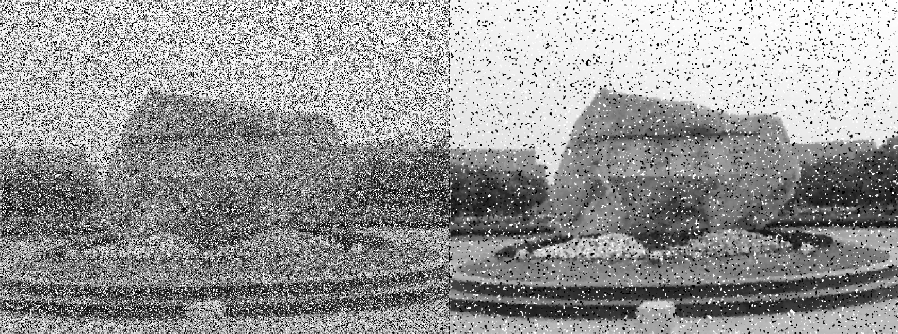
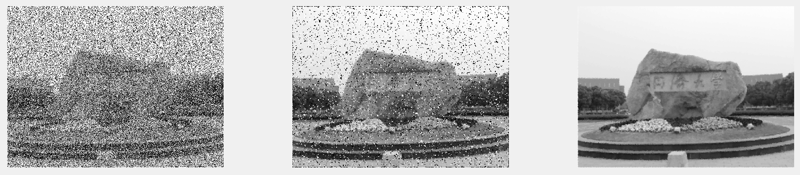

# 图像复原

[TOC]

------

## 图像退化-复原模型

- degraded -- restore --> restoration

- **退化:** degradation function + aditive noise
  $$
  g(x,y) = h(x,y) \bigotimes f(x,y) + \eta(x,y)
  $$

------

## Mean Filter | 均值滤波器

### Arithmetic Mean | 算数均值

- compute the average of corrupted image in the area defined by a neighborhood window
- **blur** the image to remove noise

$$
\hat{f}(x,y) = \frac{1}{MN}\sum_{(s,t)\in S_{x,y}}g(s,t)
$$

------

### Geometic Mean | 几何均值

- 与算数均值的平滑效果相当
- 但可以丢失更少的图像细节

$$
\hat{f}(x,y) = [\prod_{(s,t)\in S_{x,y}}g(s,t)]^{\frac{1}{MN}}
$$

------

### Harmonic | 谐波均值

- 可以处理salt noise，但是不能处理pepper noise

  > 像素等于0时分母太大了，产生无效值，原像素完全不占主导地位

- **可以当作公平性的损失函数**

$$
\hat{f}(x,y) = \frac{MN}{\sum \limits_{(s,t)\in S_{x,y}} \frac{1}{g(s,t)}}
$$

------

### Conharmonic | 逆谐波均值

- 可以处理salt & pepper noise，但不能同时处理二者

- Q>0，消除pepper noise

  Q<0，消除salt noise

$$
\hat{f}(x,y) = \frac{\sum \limits_{(s,t)\in S_{x,y}}g(s,t)^{Q+1}}{\sum \limits_{(s,t)\in S_{x,y}}g(s,t)^{Q}}
$$

------

## Order Statistic Filter | 统计排序

ordering{ranking} the value of the pixels contained in the image area encompassed by the filter

### Median | 中值

- less blurring the linear something filter
- **单极或双级脉冲下效果尤其好**
- 但是对于噪声密度非常大时无法去除干净（中值仍是噪声）

$$
\hat{f}(x,y) = \mathop{median}_{(s,t)\in S_{x,y}}\{g(s,t)\}
$$

```matlab
medfilt2(salt_pepper_noise_img)
```



------

### Max/Min | 最大值/最小值

- max filter --> pepper noise (取最大值，把黑色的干掉)

  min filter --> salt noise

$$
\hat{f}(x,y) = \max_{(s,t)\in S_{x,y}}\{g(s,t)\}
$$

$$
\hat{f}(x,y) = \min_{(s,t)\in S_{x,y}}\{g(s,t)\}
$$

------

### Midpoint | 中点

- 计算最大值和最小值的均值
- good for Gaussian, uniform

$$
\hat{f}(x,y) = \frac{1}{2}[\max_{(s,t)\in S_{x,y}}\{g(s,t)\} \ + \min_{(s,t)\in S_{x,y}}\{g(s,t)\}]
$$

------

### Alpha-Trimmed Mean | 修正的alpha均值

- 用于解决salt & pepper太多了，median还是噪声
- 可以应对多种噪声叠加 (比如salt & pepper + Gaussian)
- 删掉$\frac{d}{2}$lowest，$\frac{d}{2}$highest，剩下$MN-d$个像素为$g_r$

$$
\hat{f}(x,y) = \frac{1}{MN-d}\sum \limits_{(s,t)\in S_{xy}}g_r(s,t)
$$

------

## Adaptive filter | 自适应滤波器

### Adaptive Median Filter | 自适应中值滤波器

- **目标：**
  - 去除Impulse noise
  - smoothing other noise
  - less blurring(reduce distortion)
- **notation:**
  - $z_{min}$: minimum grey level in $S_{xy}$
  - $z_{max}$: maximum grey level in $S_{xy}$
  - $z_{med}$: median of grey levels in $S_{xy}$
  - $z_{xy}$: grey level at coordinates $(x,y)$
  - $S_{max}$: maximum allowed size of $S_{xy}$
- 随着脉冲密度的增大，需要更大的窗口消除Impulse噪声

**算法**

```
Stage A:
	A1 = z_med - z_min
	A2 = z_med - z_max
	
	if A1>0 and A2<0:		//中点值不是噪声，median工作正常
		go to Stage B
	else:			//中间点还是impulse噪声
		Increase the window_size
		
	if window_size <= S_max:
		repeat Stage A
	else:
		Output z_med		//不能保证这个值不是脉冲

Stage B:
	B1 = z_xy - z_min
	B2 = z_xy - z_max
	
	if B1>0 and B2<0:
		Output z_xy		//不改变中间灰度级的点，减少图像的失真
	else:
		Output z_med	//中值滤波
```



> 扩充图像的时候如果用0补边的话，滤波之后图像边缘处的噪声无法去除
>
> 