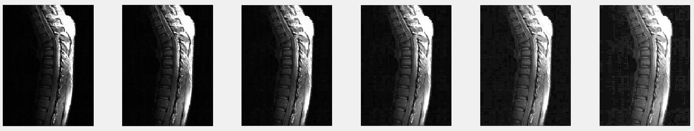
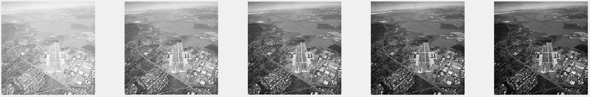
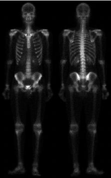
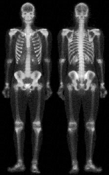
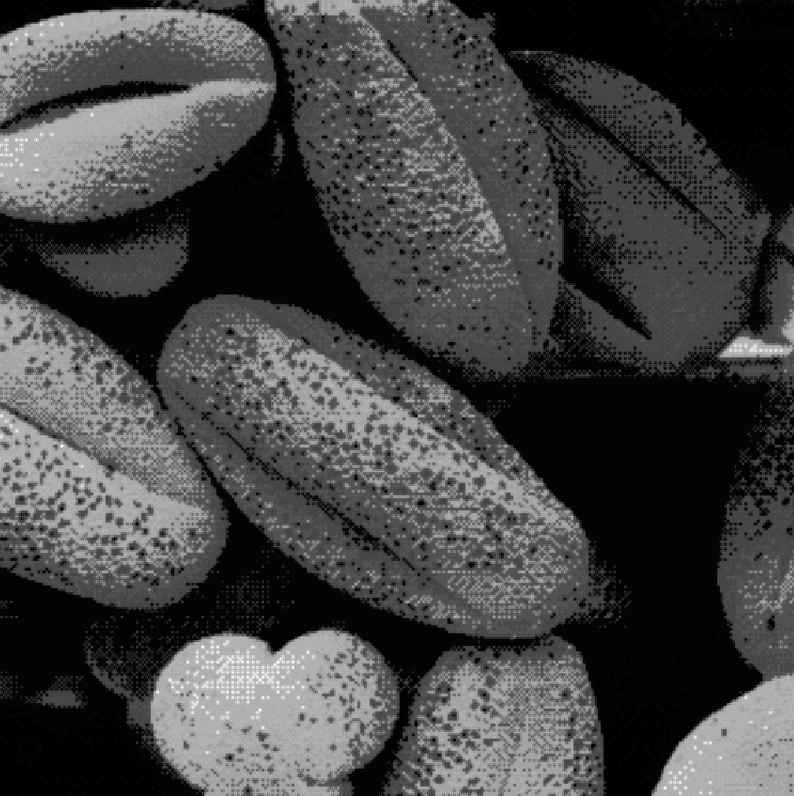

# 灰度变换函数 | Basic Intensity Transformation Functions

[TOC]

------

## 图像反转 | Image Negatives

- **灰度级范围：**`[0, L-1]`

- **公式：**`s = L - 1 - r`

- **库函数：**

  ```matlab
  negatives_I = imcomplement(I);
  ```

- **用处：**增强嵌入图像暗色区域的白色或灰色细节，特别是当黑色面积在尺寸上占主导地位时。

**原图**


**反转**


------

## 门限 | Thresholding

- **公式：**
  $$
  s = \left\{\begin{array}{1}{1, r > threshold} \\ 0, otherwise\end{array}\right.
  $$

- **库函数：**

  ```matlab
  % 定义门限值，注意范围是0～1
  threshold = 0.5;
  J = im2bw(I, threadhold);
  ```

- **用处：**将感兴趣的物体从背景中孤立出来 -> 分割

**原图**


**门限**（只将🌺 主体提取出来）


------

## Log变换 | Log Transformations

- **公式：**`s = c * log(1 + r)`
  - `c = 255/log(1 + 255)`时，保持刻度一致
- **用处：**扩展黑像素，压缩白像素（*<u>想观察的信息隐藏在黑色中</u>*）

**原图**


**Log变换**


------

## γ变换 | Gamma Transformations

- **公式：**$s = c * r^γ$
- **用处：**色彩校正
  - Gamma变换不仅会改变亮度，而且会改变rgb的比率

### 图像过暗

**原图**


**γ变换**



### 图像过亮

**原图**


**γ变换**



------

## 分段线型函数

### 对比度拉伸 ｜ Contrast Stretching

扩展图像灰度级动态范围，可以跨越记录介质和显示装备的全部灰度范围

#### Logistic函数 | 生长函数

- **函数模型：**
  $$
  \frac{1}{1 + (m/r)^E} , \ m,E为常数
  $$

- **函数图像：**

  

- **函数分析：**

  - 原始函数模型的定义域和值域都是[0, 1]

  - **参数：**

    - m：图像x方向的中心点，该点的函数值也为中心

    - E：控制图像上升的速度和分段数**(E越大，上升的速率越快)**

      

      

- **函数变换：**

  - 通过m调节横坐标的范围（m在这里相当于常量）

    > 在图像处理时将m取成255/2，可以使得横坐标从0～255

  - 通过引入常量a调节纵坐标的范围
    $$
    \frac{a}{1 + (a * m/r)^E}
    $$

    > 在图像处理时将a取成255，可以使得纵坐标拉伸到255

    
    
  - 通过引入常量deltax进行x轴平移，用适当的方式调节黑色区域和白色区域的映射
    $$
    \frac{a}{1 + (\frac{a * m}{(r + deltax)^E})}
    $$
    

- **最终的函数模型：**

  ```matlab
  a = 255;
  E = 10;
  r = 0:0.1:255;
  
  s = a ./ (1 + (a*0.5./r).^E);
  ```

  

------

#### 两点线性 ｜ Piece Wise Linear

- **函数模型：**

  

**原图**



**对比度拉伸**



**原图**


**对比度拉伸**



------

