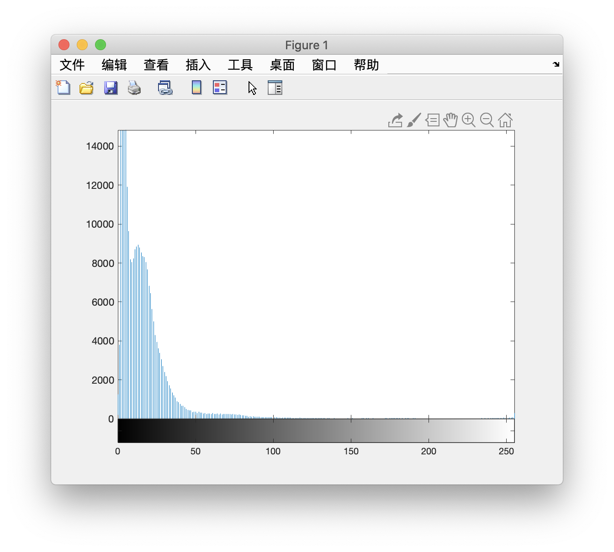
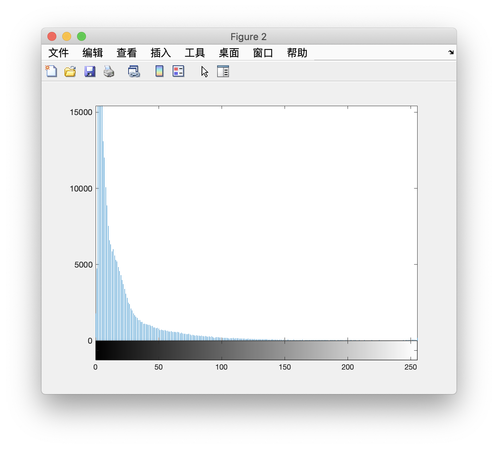
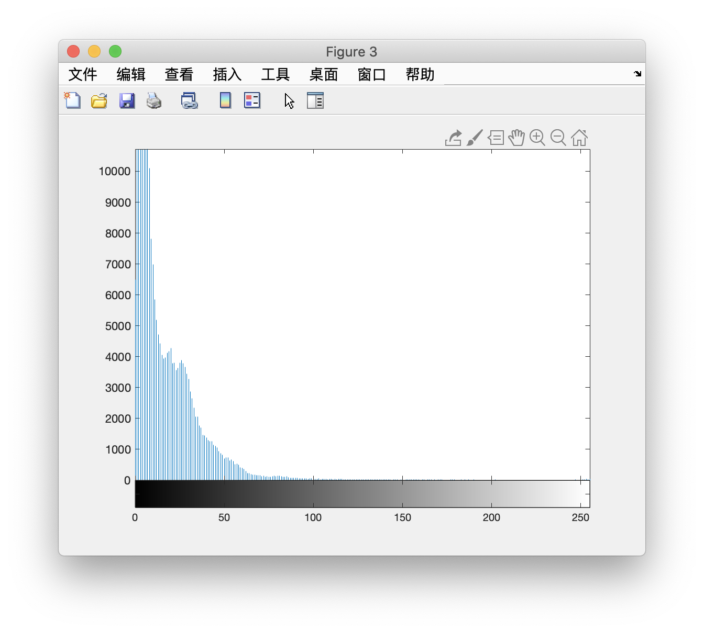

# Nighttime Road Contrast Enhancement 

[TOC]

------

## 1. Description

The visibility of lane markings, road signs, and obstacles on the roads is significantly reduced at nighttime. To assist drivers in dark conditions, we can perform contrast enhancement on images captured by the cars front-facing camera and display the enhanced images to the driver. 

------

## 2. Experiment

### a) Histogram of the original images grayscale values

#### Overall Thought of the Algorithm

Use Library Functions --- imhist to generate the histogram of the original images grayscale values

#### Matlab Code

```matlab
img_path = 'Resources/';
imgs_name = ['hw1_dark_road_1.jpg';'hw1_dark_road_2.jpg';'hw1_dark_road_3.jpg'];
[M,N] = size(imgs_name);
for k=1:M
    img_name = imgs_name(k,:);
    I = imread([img_path, img_name]);
    figure;
    imhist(I);
end
```

#### Experimental Result

road1 histogram



road2 histogram



road3 histogram



#### Experimental Effect

​	From the three figures above, we can see clearly that almost all pixels are concentrated in low grayscale value. The shape of the histogram look like a steep mountain. \\ \\
​	We can also clearly see from the original picture that it looks dark, and the grayscale value of black color is closed to 0.

------

### b) Global histogram equalization

#### Overall Thought of the Algorithm

According to the 
$$
s = (L - 1)\sum_{j=0}^{k}\frac{n_j}{M*N}
$$


- $L$: the total gray level
- $M*N$: the image size
- $n_j$: the value of the jth item in the histogram

I use **incremental** idea to calculate $n_j$ in each loop, it will reduce time complexity and amount of calculation significantly.

#### Matlab Code

```matlab
function J = myhisteq(I)
% global histogram equalization

[M,N] = size(I);
s = zeros(1, 256);
[counts, pixels] = imhist(I);   % [Number of pixels per pixel | Pixel value (0~255)]

sum_count = 0;
for k=0:255
    sum_count = sum_count + counts(k + 1, 1);   % use incremental idea
    s(1,k+1) = round(255/(M*N)*sum_count);
end

% convert the grayscale in the original image to the grayscale in the new image
J = s(1,I+1);

% convert the shape to origin shape
J = uint8(reshape(J, [M, N]));

end
```

#### Experimental Result

road1 after myhisteq 


road1 after histeq 


road2 after myhisteq 


road2 after histeq 


road3 after myhisteq 


road3 after histeq 


#### Experimental Effect

​	From the Experimental Result, we can find that that the original darker images become grayer. And the histograms of modified images hold a wider grayscale range, there are more pixels have high grayscales than before.
​	We can see more details in the modified images because it has stronger constrast. For example, we can see the junction line between the buildings and a more clearly sky. 
​	But on the other hand, some details become blurred after histeq. For example, the road sign in the first image become blurred so that we cannot see the word on it. 
​	Also, from the comparison of Library Function histeq and myhisteq, we can find that Library Function complete more uniform dispersion but the figure of myhisteq getting smaller and smaller. And from the modified images themselves we can clear see that the image after histogram equalization of Library Function are more visually than after my personal histogram equalization.

------

### c) Locally adaptive histogram equalization

#### Overall Thought of the Algorithm

Use Library Function --- `adapthisteq'`to apply locally adaptive histogram equalization. \\ \\
    And about this function, I can customize two parameters:

-  $NumTiles: $ Two-element vector of positive integers: [M N]. [M N] specifies the number of tile rows and columns. Both M and N must be at least 2. The total number of image tiles is equal to M*N.
-  $ClipLimit$: Real scalar from 0 to 1. 'ClipLimit' limits contrast enhancement. Higher numbers result in more contrast. 

#### Matlab Code

```matlab
for k=1:M
    img_name = imgs_name(k,:);
    I = imread([img_path, img_name]);
    
    % adaptive histogram equalization
    numtiles = 16; cliplimit = 0.018;
    J = adapthisteq(I, ...
                    'NumTiles',[numtiles, numtiles], ...
                    'ClipLimit', cliplimit);
    imwrite(J, [result_path, 'adapthisteq_16_16_0.018_', num2str(k), '.png']);
end
```

#### Experimental Result

**The role of NileTiles** 

NumTiles: 2*2 


NumTiles: 4*4 


NumTiles: 8*8


NumTiles: 16*16


NumTiles: 32*32


NumTiles: 64*64 


**The role of ClipLimit** 

ClipLimit: 0.01 


ClipLimit: 0.05 


ClipLimit: 0.1 


ClipLimit: 0.5 


#### Experimental Effect

​	At last, I choose $NumTiles = 16*16$ and $ClipLimit = 0.018$ to apply locally adaptive histogram equalization. The result are as followed:

road1 after adaptive histogram equalization 


road2 after adaptive histogram equalization 


road3 after adaptive histogram equalization 


​	The orange figure is histograms after
$$
adapthisteq(I, 'NumTiles',[numtiles, numtiles], 'ClipLimit', cliplimit)
$$
​	and blue one is histograms of origin images.

​	We can have a straight comparison visually that we can get more information and details from the modified images. In road1, we can see street sign behind; in road2, the cars and roadblocks in the distance are very clear; in road3, trees by the road and windows on the building are all visually.

------

### d) $\gamma$ - nonlinearity mapping to each image to perform contrast enhancement

#### Overall Thought of the Algorithm

​	Build $\gamma$ function model and try different coefficients. The function model is:
$$
J = c * I^{\gamma}
$$
​	And I use $c$ to keep the coordinate scale consistent
$$
c = \frac{255}{255^{\gamma}}
$$
​	Then I draw different image curves and compare different modified images to perform contrast enhancement.

**Function image corresponding to different gamma values**


#### Matlab Code

```matlab
for k=1:M
    img_name = imgs_name(k,:);
    I = imread([img_path, img_name]);
    
    for gamma=0.4:0.1:1
        J = GammaNonlinearityMapping(I, gamma);
    end
end


function J = GammaNonlinearityMapping(I, gamma)
% use gamma-onlinearity mapping to perform contrast enhancement

% keep the coordinate scale consistent
c = 255/(255^gamma);

% gamma transformation
J = uint8(c*double(I).^gamma);

end
```

#### Experimental Result

**γ mapping of road1** 

road1 γ = 0.5 


road1 γ = 0.6


road1 γ = 0.7


road1 γ = 0.8 


road1 γ = 0.9 


road1 γ = 1.0 


------

**γ mapping of road2** 


road1 γ = 0.6


road1 γ = 0.7


road1 γ = 0.8 


road1 γ = 0.9 


road1 γ = 1.0 


------

**γ mapping of road3**


road1 γ = 0.6


road1 γ = 0.7


road1 γ = 0.8 


road1 γ = 0.9 


road1 γ = 1.0 


#### Experimental Effect

From the result images, we can find what we make can prove what we learned in class correctly. Lower $\gamma$(less than 1) will expand dark pixels to a more broad pixels area.

When $\gamma = 0.7$, I think it has an appealing visual effect and we can get most of the information we want to observe.