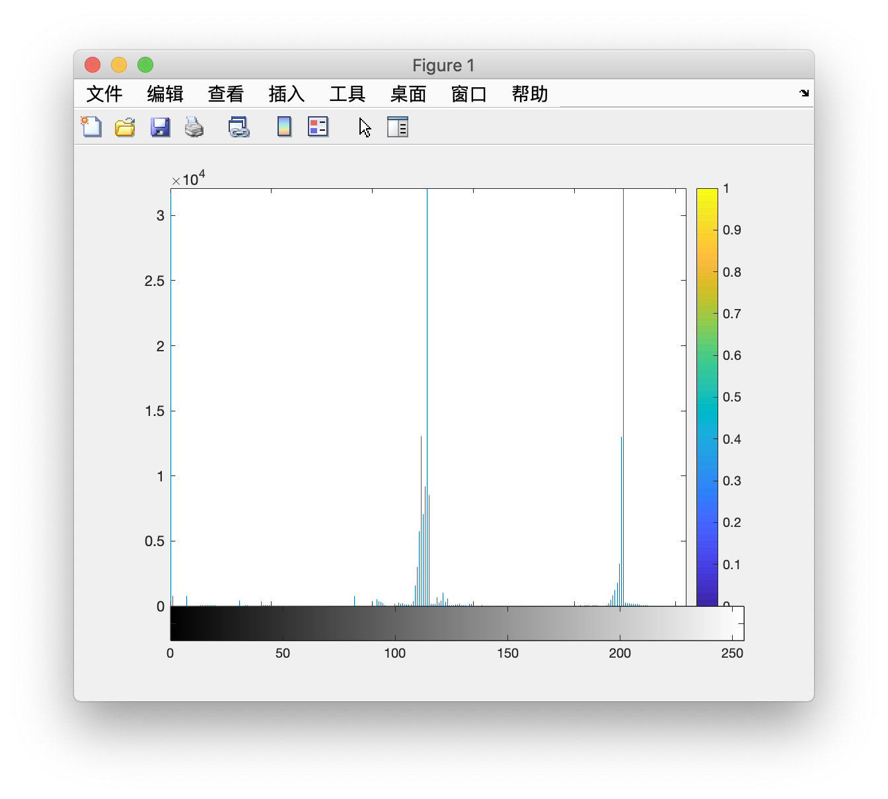
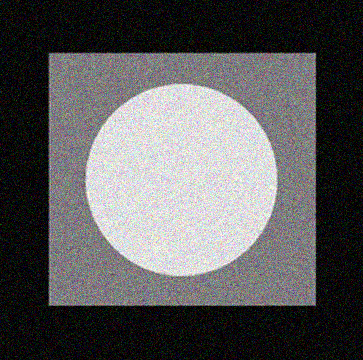
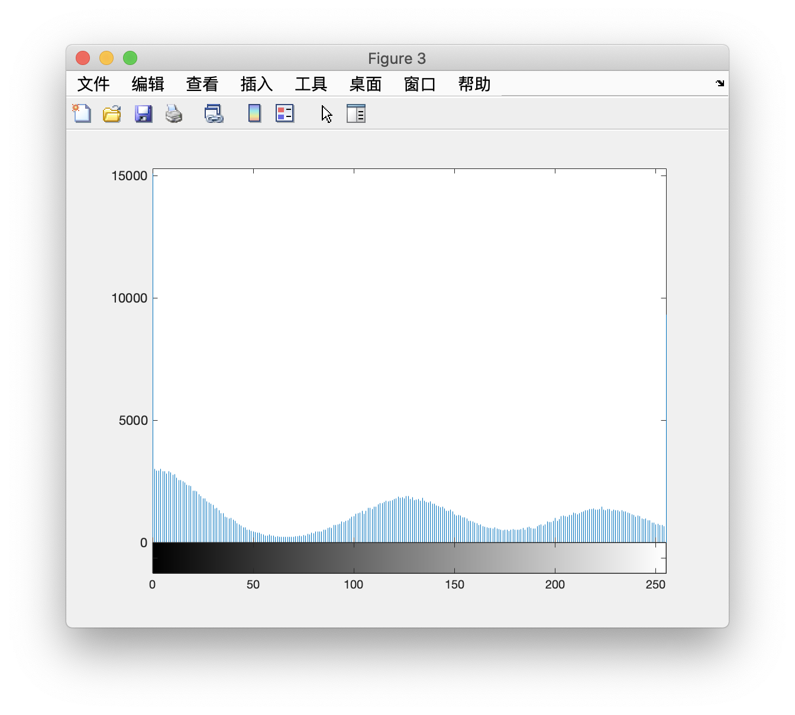
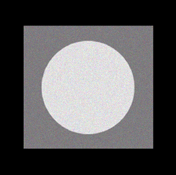
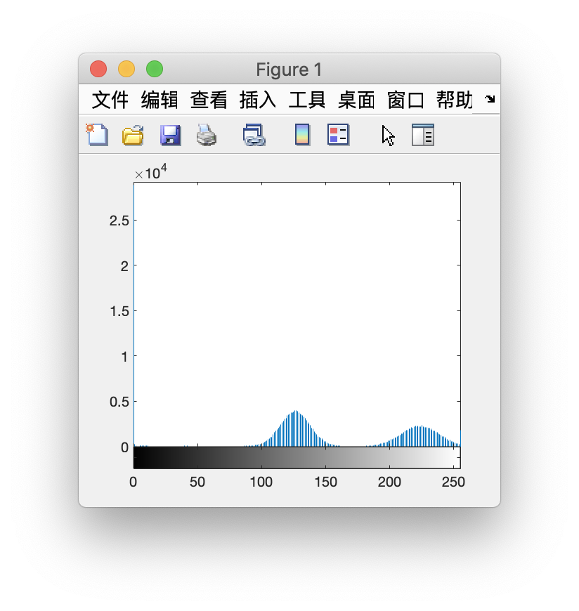
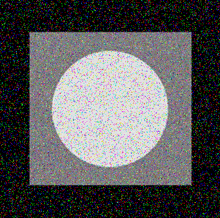
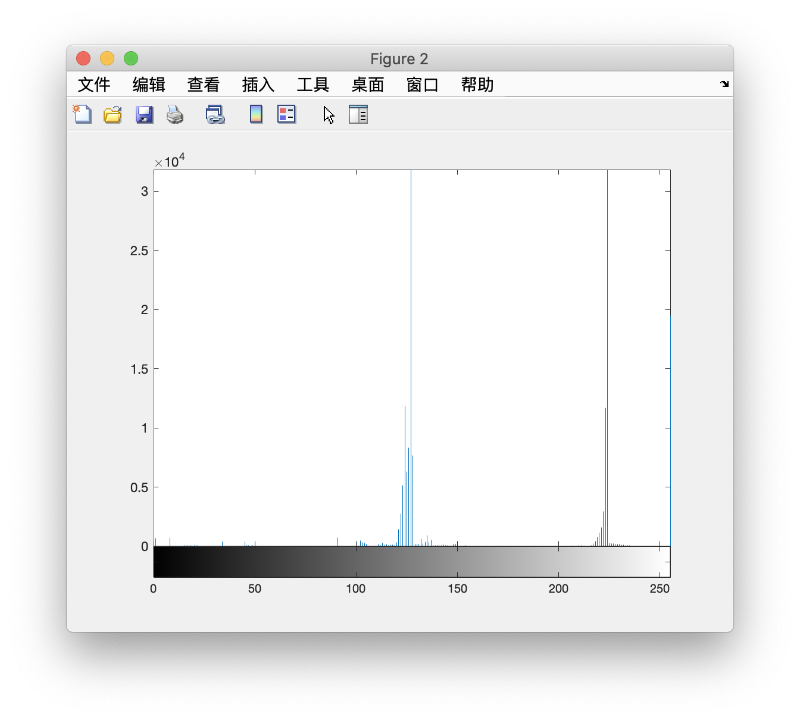
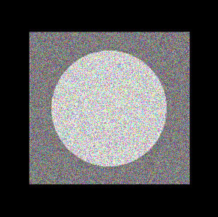
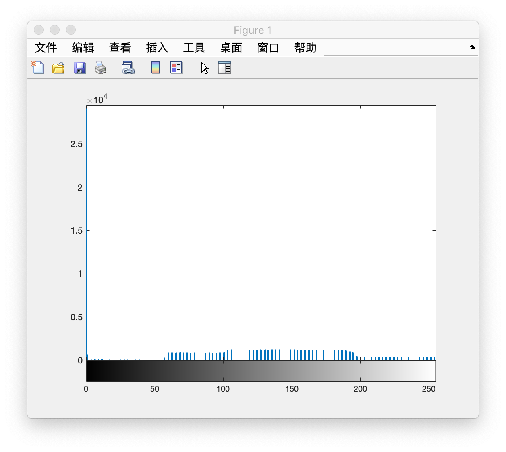

# 噪声类型

[TOC]

------

**原图**

------

## Gaussian | 高斯

------

## Poisson | 柏松

------

## Rayleigh | 瑞利

------

## Erlang(Gamma) | 爱尔兰

------

## Exponential | 指数

------

## Uniform | 均匀

------

## Impulse | 脉冲

### Salt & pepper noise | 椒盐

------

## Speckle | 斑点噪声

------

## 周期噪声

- 由于电子元件，会产生周期噪声
- 正弦波的傅立叶变换是位于正弦波共轭频率处的一堆共轭脉冲
- 图像叠加了周期噪声，转换到频域会产生明显的白点
- 可以通过频域滤波显著消除