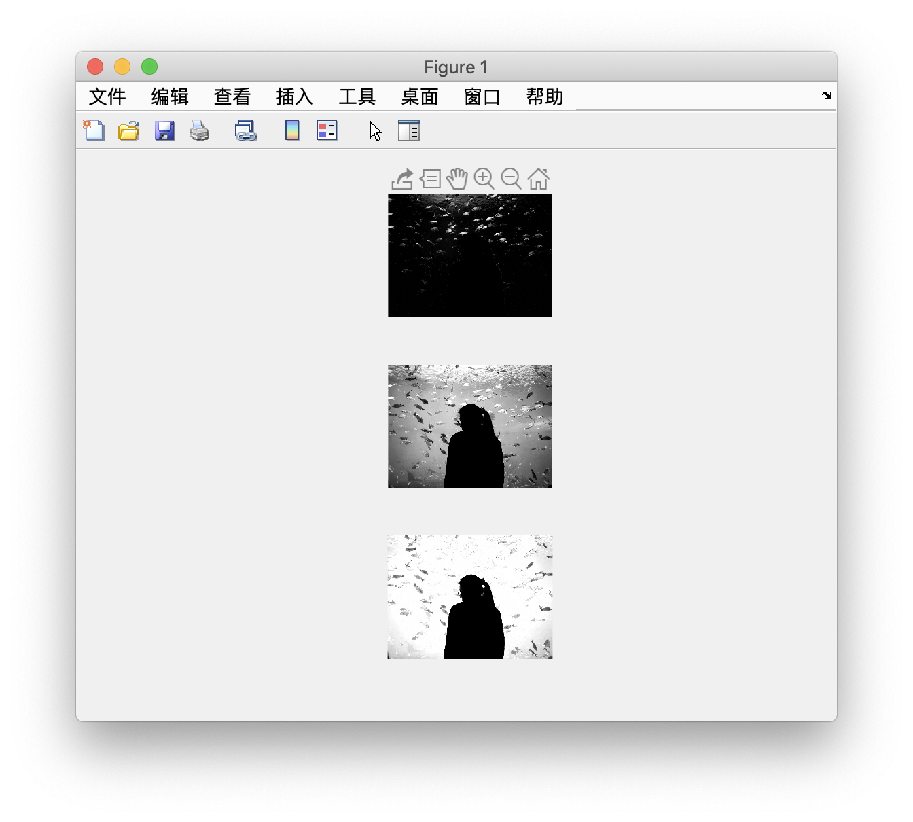

# 提取RGB图片的三个通道

* [原图](#原图)
* [提取后的结果](#提取后的结果)
* [三色灰度图](#三色灰度图)
   * [R](#r)
   * [G](#g)
   * [B](#b)
* [主要函数](#主要函数)
   * [imread: 读取图片文件](#imread-读取图片文件)
   * [imwrite：将矩阵写出成图片文件](#imwrite将矩阵写出成图片文件)
   * [imshow：将矩阵绘制成图片](#imshow将矩阵绘制成图片)
   

------

## 原图

## 提取后的结果

## 三色灰度图

⚠️任何一个通道的图像仍然是灰度图，因为每个通道都是一个值，所以Img_R相当于是一个二维矩阵

### R

### G

### B

------

## 主要函数

### imread: 读取图片文件

### imwrite：将矩阵写出成图片文件

### imshow：将矩阵绘制成图片

