# 「imresize」Realization

* [1. Description](#1-description)
* [2. Development Environment](#2-development-environment)
* [3. How To Run](#3-how-to-run)
* [4. Experiment](#4-experiment)
   * [4.1 Different Images Kinds](#41-different-images-kinds)
      * [4.1.1 Grayscale](#411-grayscale)
      * [4.1.2 RGB](#412-rgb)
   * [4.2 Different Images Scale](#42-different-images-scale)
      * [4.2.1 1 to 1](#421-1-to-1)
      * [4.1.2 n to 1](#412-n-to-1)
   * [4.3 Time Effection Comparison](#43-time-effection-comparison)
      * [4.1.1 scale from 1 to 1.1](#411-scale-from-1-to-11)
      * [4.1.2 scale from 0.9 to 1.1](#412-scale-from-09-to-11)
      * [4.1.3 scale from 1.0 to 2.0](#413-scale-from-10-to-20)
   * [4.4 Similarity](#44-similarity)
* [5. Realization](#5-realization)
   * [5.1 Nearest Neighbor Interpolation Algorithm](#51-nearest-neighbor-interpolation-algorithm)
      * [5.1.1 Overall Thought of the Algorithm](#511-overall-thought-of-the-algorithm)
      * [5.1.2 Implementation Step](#512-implementation-step)
   * [5.2 Bilinear Interpolation Algorithm](#52-bilinear-interpolation-algorithm)
      * [5.2.1 Overall Thought of the Algorithm](#521-overall-thought-of-the-algorithm)
      * [5.2.2 Implementation Step](#522-implementation-step)
   * [5.3 Bicubic Interpolation Algorithm](#53-bicubic-interpolation-algorithm)
      * [5.3.1 Overall Thought of the Algorithm](#531-overall-thought-of-the-algorithm)
      * [5.3.2 Implementation Step](#532-implementation-step)
* [6. About the Author](#6-about-the-author)
* [7. Project Structure](#7-project-structure)

------

## 1. Description

In this project, you can resize your image which is `SCALE` times the size of the origin one, and the image you input can be a `grayscale`, `RGB` and the height & width of the image can be `1 to 1` or `n to 1`(n is a real number).

------

## 2. Development Environment

- **Development Environment:** macOS Mojave 10.14.6
- **Development Software:** MATLAB_R2019a
- **Development Language:** matlab

------

## 3. How To Run

1. You should put the fellowing matlab script in your working path.
   - `myimresize.m`
   - `Nearest.m`
   - `Bilinear.m`
   - `Bicubic.m`
2. You can write your own program in this working path.
3. In your own program, firstly, you should use `imread()` to load your image.
4. Then, you can use `myimresize(img, scale, algorithm)` to resize your image.
   - parameter `img`: the matrix you just load by `imread()`
   - parameter `scale`: the scale you want to resize for the image
   - parameter `algorithm`: you can choose which algorithm will be used in the program
     - `nearest`: Nearest Neighbor Interpolation Algorithm
     - `bilinear`: Bilinear Interpolation Algorithm
     - `bicubic`: Bicubic Interpolation Algorithm
   - result value: the new image with the SCALE`times the size of the origin one
5. You can use `imshow(new_img, []);`to observe the result.
6. You can run `test.m` to observe the result of the `myimresize()` function.
7. And you can run `TimeCompare.m` to observe the time effection by different algorithm and I added the library function --- `imresize()` to compare with.

------

## 4. Experiment

### 4.1 Different Images Kinds

#### 4.1.1 Grayscale

origin

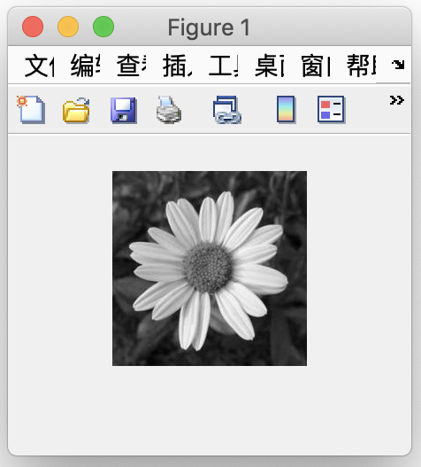

scale = 0.5

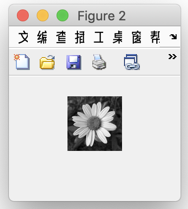

scale = 2

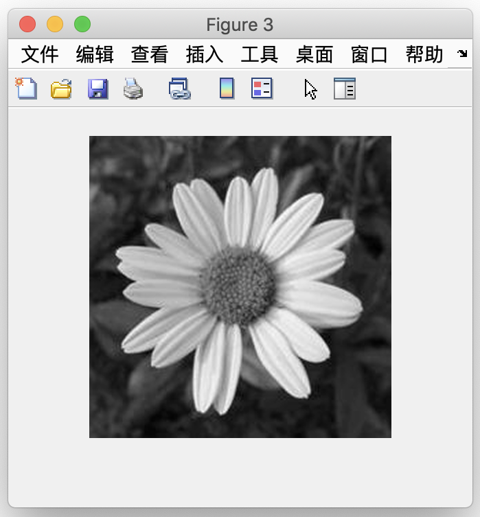

#### 4.1.2 RGB

origin

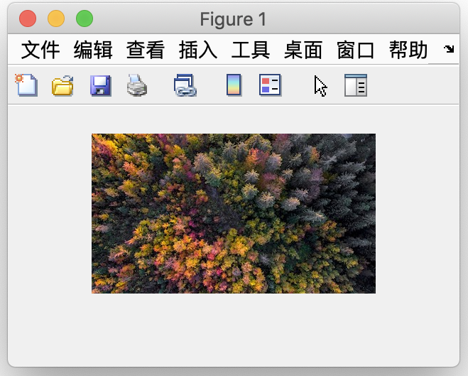

scale = 0.5

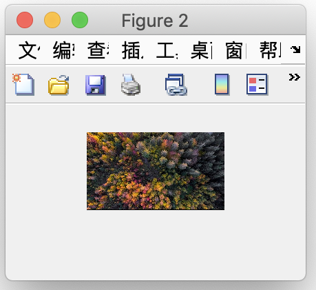

scale = 2

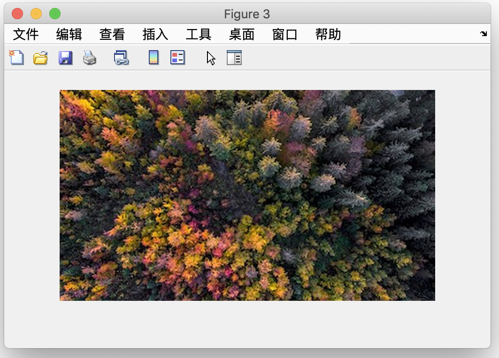

------

### 4.2 Different Images Scale

#### 4.2.1 1 to 1

origin

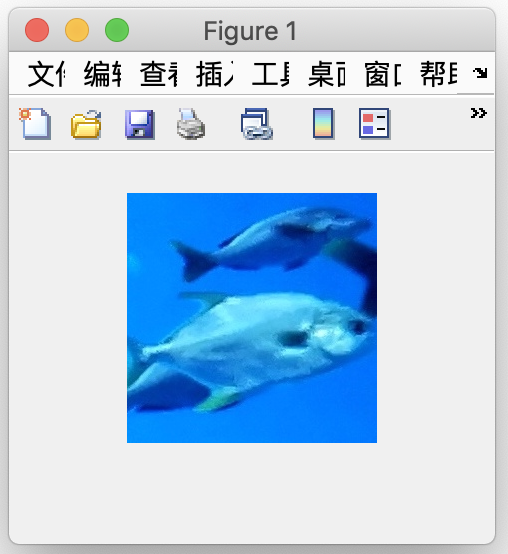

scale = 0.5

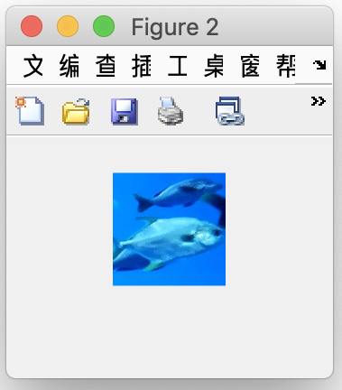

scale = 2

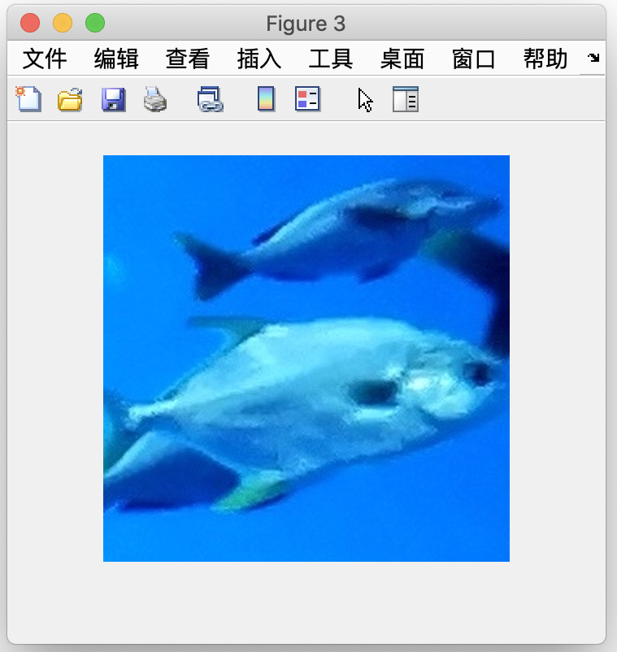

#### 4.1.2 n to 1

origin

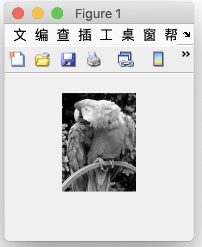

scale = 0.5

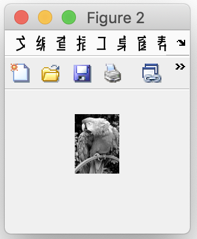

scale = 2

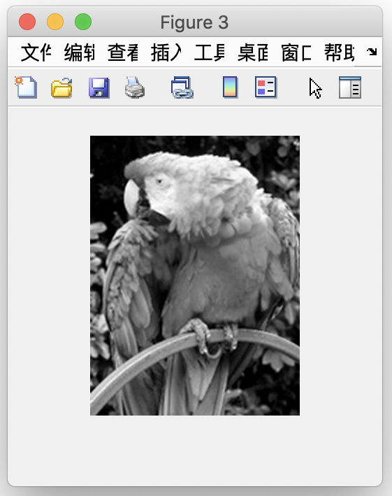

------

### 4.3 Time Effection Comparison

- After finish 3 different algorithms for imresize, I decide to write a program for testing time affection of different algorithm.

- Choose a time interval and initialize the time lists which is used to store different time

  ```matlab
  scales = 0.9:0.01:1.1;
  t_library = zeros(size(scales));		% Library Function - imresize
  t_nearest = zeros(size(scales));		% Nearest Algorithm
  t_bilinear = zeros(size(scales));		% Bilinear Algorithm
  t_bicubic = zeros(size(scales));		% Bicubic Algorithm
  ```

- Use library function in MATLAB to calculate the spending time

  ```matlab
  tic;
  % ...
  % TODO
  % ...
  toc;
  t = toc;
  ```

- Run 4 different algorithms, and store the spending time in personal vector.

- Finally, ploting the 4 curves in one figure.

#### 4.1.1 scale from 1 to 1.1

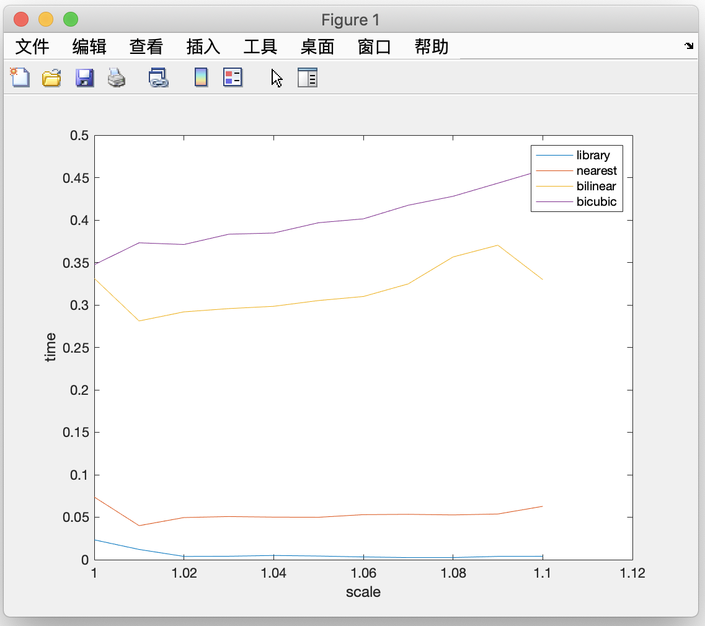

#### 4.1.2 scale from 0.9 to 1.1

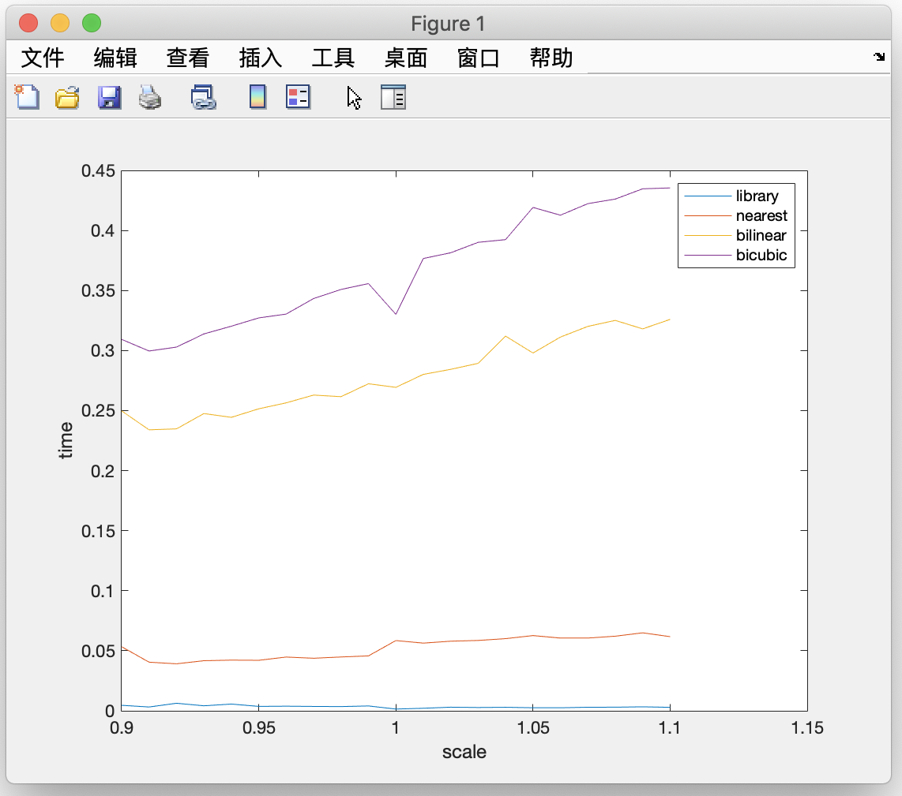

#### 4.1.3 scale from 1.0 to 2.0

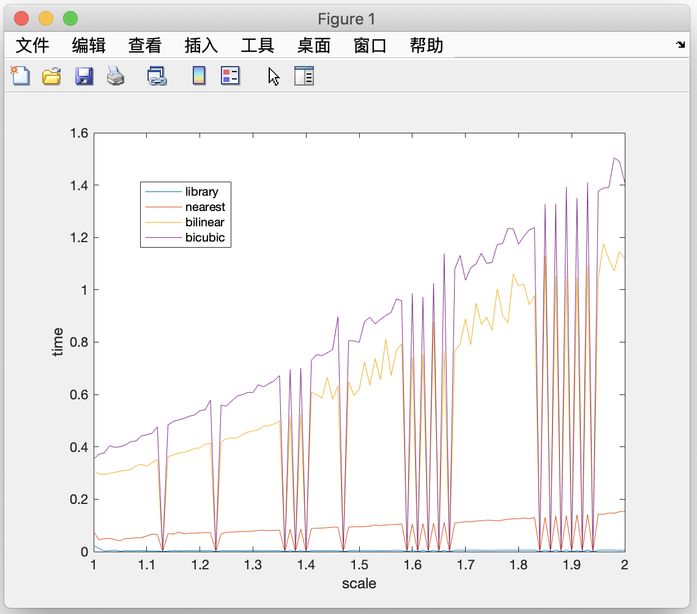

- **From the figure I conclude several feeling for this experiment:**
  - More complex algorithm means more powerful processing capacity, and at the same time, means more time spending to calculate.
  - For 3 algorithms I wrote, the spending time grow bigger with the scale from low to high on the whole, but if the scale is similar to 1 which means the result image is nearly the same as the origin image, the speeing time for 3 algorithms will get the minimum value in the nearby interval.
  - The library function hold the absolute time effection in the `imresize` algorithm, the 3 algorithms by myself are so naive, and I hold the firm belief that on the condition that I want to write an algorithm with the same function & effection, I should polish my algorithm again and again, maybe the spending time for modify will last for several months, even several years.
  - I have just step in to the realm of DIP, I should try my best to learn, to try, to make mistakes. There are always more thing I can learn than I think.

### 4.4 Similarity

I also want to use some method to observe the result from my algorithm compare with the result from library function. I think I can write a function to compare two matrix, which can get the similarity of two matrix, so that I can know whether my algorithms are effective.

But, much to my regret, according to my current knowledge of Digital Image Processing, I cannot solve this problem. I hold the firm belief that the professor can help me to solve this question. I would be exceedingly thankful for your teach.

------

## 5. Realization

### 5.1 Nearest Neighbor Interpolation Algorithm

#### 5.1.1 Overall Thought of the Algorithm

- Find the nearest pixel point for insertion point(converse the result image scale to origin image scale).
- Use the pixel of this nearest point to fill the insertion point.
- The "nearest" means the shortest distance, the distance equation should be Euler Distance

#### 5.1.2 Implementation Step

1. Create the result matrix with the target size.

   ```matlab
   [origin_width, origin_height, type] = size(origin_img);
   ...
   result_img = im2uint8(zeros(target_size(1), target_size(2), type));
   ```

2. Traversal the target matrix, for each position (x,y) do the following steps:

   1. Map the position from result image to the origin image and find the nearby 4 points.

      ```matlab
      a = (x+0.5) / scale + 0.5;
      b = (y+0.5) / scale + 0.5;
      [a1,a2,b1,b2] = growNearest(a, b, origin_size(1), origin_size(2));
      
      function [a1,a2,b1,b2] = growNearest(a, b, width, height)
      % 找到附近的4个位置（边界检查）
      
      a1 = round(a);
      if a1>width-1, a1 = width-1; end
      a2 = a1 + 1;
      
      b1 = round(b);
      if b1>height-1, b1 = height-1; end
      b2 = b1 + 1;
      
      end
      ```

   2. Find the nearest point from the 4 nearby points of this position(Euler Distance)

      ```matlab
      % 寻找四个位置中距离插值点最近的位置
      D = [distance(a,b,a1,b1),distance(a,b,a1,b2),distance(a,b,a2,b1),distance(a,b,a2,b2)];
      [min_x, min_y] = findMinPos(a1,a2,b1,b2,D);
              
      function length = distance(x, y, a, b)
      % 返回点(x,y)到点(a,b)的欧拉距离平方
      % 只需要比较距离大小进行选择，这里省去开根运算
      
      length = (x-a)^2 + (y-b)^2;
      
      end
      ```

   3. According to the kind of the image, copy the pixel of the nearest point to the result image.

      ```matlab
      for z=1:type
        try
          % 将这个点的像素赋予插值点
          result_img(x,y,z) = origin_img(min_x,min_y,z);
        end
      end
      ```

------

### 5.2 Bilinear Interpolation Algorithm

#### 5.2.1 Overall Thought of the Algorithm

- Linear interpolation for both x-direction & y-direction.

- Linear interpolation: 

  

  The expression of the line can be writen as $\frac{y-y_{0}}{x-x_{0}}=\frac{y_{1}-y_{0}}{x_{1}-x_{0}}$, and I can transform the form into $y=y_{0}+\left(x-x_{0}\right) \frac{y_{1}-y_{0}}{x_{1}-x_{0}}=y_{0}+\frac{\left(x-x_{0}\right) y_{1}-\left(x-x_{0}\right) y_{0}}{x_{1}-x_{0}}$

- And for two-dimension:

  
  
  - Firstly, interpolate in the x-dimension, the R1, R2 is the result.
  
    $f\left(x, y_{1}\right) \approx \frac{x_{2}-x}{x_{2}-x_{1}} f\left(Q_{11}\right)+\frac{x-x_{1}}{x_{2}-x_{1}} f\left(Q_{21}\right)$
    $f\left(x, y_{2}\right) \approx \frac{x_{2}-x}{x_{2}-x_{1}} f\left(Q_{12}\right)+\frac{x-x_{1}}{x_{2}-x_{1}} f\left(Q_{22}\right)$
  
  - Then interpolate again in the y-dimension for R1-R2
  
    $\begin{aligned} f(x, y) & \approx \frac{y_{2}-y}{y_{2}-y_{1}} f\left(x, y_{1}\right)+\frac{y-y_{1}}{y_{2}-y_{1}} f\left(x, y_{2}\right) \\ &=\frac{y_{2}-y}{y_{2}-y_{1}}\left(\frac{x_{2}-x}{x_{2}-x_{1}} f\left(Q_{11}\right)+\frac{x-x_{1}}{x_{2}-x_{1}} f\left(Q_{21}\right)\right)+\frac{y-y_{1}}{y_{2}-y_{1}}\left(\frac{x_{2}-x}{x_{2}-x_{1}} f\left(Q_{12}\right)+\frac{x-x_{1}}{x_{2}-x_{1}} f\left(Q_{22}\right)\right) \\ &=\frac{1}{\left(x_{2}-x_{1}\right)\left(y_{2}-y_{1}\right)}\left(f\left(Q_{11}\right)\left(x_{2}-x\right)\left(y_{2}-y\right)+f\left(Q_{21}\right)\left(x-x_{1}\right)\left(y_{2}-y\right)+f\left(Q_{12}\right)\left(x_{2}-x\right)\left(y-y_{1}\right)+f\left(Q_{22}\right)\left(x-x_{1}\right)\left(y-y_{1}\right)\right) \\ &=\frac{1}{\left(x_{2}-x_{1}\right)\left(y_{2}-y_{1}\right)}\left[x_{2}-x_{1}-x_{1}\right]\left[\begin{array}{cc}{f\left(Q_{11}\right)} & {f\left(Q_{12}\right)} \\ {f\left(Q_{21}\right)} & {f\left(Q_{22}\right)}\end{array}\right]\left[\begin{array}{l}{y_{2}-y} \\ {y_{2}-y_{1}}\end{array}\right] \end{aligned}$
  
  - Change it into matrix operation form.
  
    $f(x, y)=[1-u, u]\left[\begin{array}{l}{f(i, j) f(i, j+1)} \\ {f(i+1, j) f(i+1, j+1)}\end{array}\right]\left[\begin{array}{c}{1-v} \\ {v}\end{array}\right]$

#### 5.2.2 Implementation Step

1. Extend the boundary of the origin image

   - Firstly, add two rows and two cols more for the temp image.
   - Copy the origin image to the center of the temp images.
   - Copy the first row of the origin image to the top blank line.
   - Copy the last row of the origin image to the bottom blank line.
   - Copy the first column of the origin image to the left blank line.
   - Copy the first column of the origin image to the right blank line.
   - Copy the four vertex.

   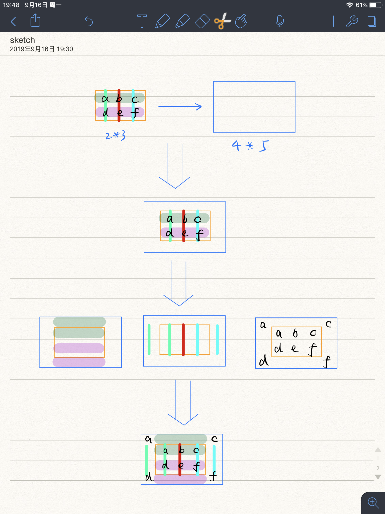

   ```matlab
   % 扩展原始图片矩阵边缘
   extended_img = ExtendImg(origin_img, origin_size, type);
   
   function tmp_img = ExtendImg(origin_img, origin_size, type)
   % 将原始矩阵上下左右各包一层白边，并用相应的原始值填充
   
   m = origin_size(1); n = origin_size(2);
   tmp_img = zeros(m+2,n+2,type);              % 上下左右各添一个白边
   tmp_img(2:m+1,2:n+1,:) = origin_img;        % 把原始图片放到正中间，上下左右为空
   tmp_img(1,2:n+1,:) = origin_img(1,:,:);     % 原矩阵的第一行填充上边的空
   tmp_img(m+2,2:n+1,:) = origin_img(m,:,:);   % 原矩阵的最后一行填充下边的空
   tmp_img(2:m+1,1,:) = origin_img(:,1,:);     % 原矩阵的第一列填充左边的空
   tmp_img(2:m+1,n+2,:) = origin_img(:,n,:);   % 原矩阵的最后一列填充右边的空
   tmp_img(1,1,:) = origin_img(1,1,:);         % 左上角
   tmp_img(1,n+2,:) = origin_img(1,n,:);       % 右上角
   tmp_img(m+2,1,:) = origin_img(m,1,:);       % 左下角
   tmp_img(m+2,n+2,:) = origin_img(m,n,:);     % 右下角
   
   end
   ```

2. Traversal the target matrix, for each position (x,y) do the following steps:

   1. Map the position from result image to the origin image and get the four boundary points.

   2. The boundary points are: `(i,j)`, `(i,j+1)`, `(i+1,j)`, `(i+1,j+1)`

   3. In accordance with the Interpolation Formula to calculate the pixel value.

      ```matlab
      result_img(x,y,:) = (1-u)*(1-v)*extended_img(i,j,:) + (1-u)*v*extended_img(i,j+1,:) + u*(1-v)*extended_img(i+1,j,:) + u*v*extended_img(i+1,j+1,:);
      ```

   4. And I also use the matrix operation to calculate the pixel value in a compactly form.

      ```matlab
      U = [1-u, u];
      V = [1-v; v];
      
      for z=1:type
        F = [extended_img(i,j,z),extended_img(i,j+1,z);
        extended_img(i+1,j,z),extended_img(i+1,j+1,z)];
      
        try
        	result_img(x,y,z) = (U*F*V);
        end
      
      end
      ```

------

### 5.3 Bicubic Interpolation Algorithm

#### 5.3.1 Overall Thought of the Algorithm

- The value at the point (x, y) can be obtained by weighted averaging of the nearest sixteen points. 

- Each of two polynomial interpolation need a cubic functions

  $\sum_{i=0}^{3} \sum_{j=0}^{3} a_{i j} x^{i} y^{j}$

- Construct BiCubic Function:

  $W(x)=\left\{\begin{array}{ll}{(a+2)|x|^{3}-(a+3)|x|^{2}+1} & {\text { for }|x| \leq 1} \\ {a|x|^{3}-5 a|x|^{2}+8 a|x|-4 a} & {\text { for } 1<|x|<2} \\ {0} & {\text { otherwise }}\end{array}\right.$

  (The parameter `a=-0.5`)

  

#### 5.3.2 Implementation Step

1. Extend the boundary of the origin image(reference 5.2.2)

2. Traversal the target matrix, for each position (x,y) do the following steps:

   1. Map the position from result image to the origin image and get the remainder.

   2. In accordance with the BiCubic Formula to calculate the pixel value.(Matrix operation form)

      ```matlab
      A = [Ws(u+1),Ws(u),Ws(u-1),Ws(u-2)];
      C = [Ws(v+1);Ws(v);Ws(v-1);Ws(v-2)];
      
      for z = 1:type    
        try
          B = double(FI(i-1:i+2,j-1:j+2,z));
          result_img(x,y,z) = (A*B*C);    
        end
      end
      ```

------

## 6. About the Author

| Item            | Info                     |
| --------------- | ------------------------ |
| **Name**        | Zhe Zhang(张喆)          |
| **ID**          | 1754060                  |
| **Adviser**     | Prof. Qingjiang Shi      |
| **Course Name** | Digital Image Processing |
| **Course Time** | Tue. 2-4 [1-17]          |
| **Email**       | doubleZ0108@163.com      |

------

## 7. Project Structure

```
.
├── README.md
├── Resources
│   ├── color1.jpg
│   ├── color2.jpg
│   ├── gray1.jpg
│   └── gray2.jpg
├── ScreenShots
│   ├── TimeCompare1.png
│   ├── TimeCompare2.png
│   ├── TimeCompare3.png
│   ├── expand.png
│   ├── large1.png
│   ├── large2.png
│   ├── large3.png
│   ├── large4.png
│   ├── origin1.png
│   ├── origin2.png
│   ├── origin3.png
│   ├── origin4.png
│   ├── small1.png
│   ├── small2.png
│   ├── small3.png
│   └── small4.png
├── doc
│   └── imresize实现报告.pdf
└── src
    ├── Bicubic.m
    ├── Bilinear.m
    ├── Nearest.m
    ├── TimeCompare.m
    ├── myimresize.m
    └── test.m

4 directories, 29 files

```

------

